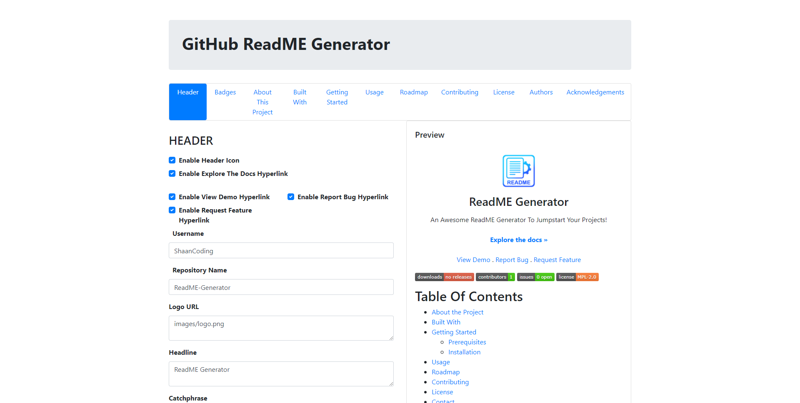

<br/>
<p align="center">
  <a href="https://github.com/ShaanCoding/ReadME-Generator">
    
  </a>

  <h3 align="center">ReadME Generator</h3>

  <p align="center">
    An Awesome ReadME Generator To Jumpstart Your Projects!
    <br/>
    Note This Project Is Still W.I.P
    <br/>
    <br/>
    <a href="https://readme.shaankhan.dev"><strong>View Demo »</strong></a>
    <br/>
    <br/>
    <a href="https://github.com/ShaanCoding/ReadME-Generator">Explore the docs</a>
    .
    <a href="https://github.com/ShaanCoding/ReadME-Generator/issues">Report Bug</a>
    .
    <a href="https://github.com/ShaanCoding/ReadME-Generator/issues">Request Feature</a>
  </p>
</p>

    [](https://discord.gg/6Kf422a)

## Table Of Contents

- [Table Of Contents](#table-of-contents)
- [About The Project](#about-the-project)
- [Built With](#built-with)
- [Getting Started](#getting-started)
  - [Prerequisites](#prerequisites)
  - [Installation](#installation)
- [Usage](#usage)
- [Roadmap](#roadmap)
- [Contributing](#contributing)
  - [Creating A Pull Request](#creating-a-pull-request)
- [License](#license)
- [Authors](#authors)
- [Acknowledgements](#acknowledgements)

## About The Project



There are many great ReadME templates available on GitHub, however, I struggled to find any ReadME generators. Throughout my open source project contributions, I've had to spend numerous hours editing README files which I could've spent developing instead. This paired with me often forgetting to change links, titles and sections made me look for a README generator.

Whilst alternative options existed, I struggled to find one that could suit my needs whilst being fast and easy to use, the ones I found were command-line based, only taking a limited input with the inability to go back on, as such I've built this, a README Generator!

With this open-source project, I hope to allow you to save as much time as it saved me, the benefits of this project are huge and here's why:

- Your time should be focused on creating something amazing. A project that solves a problem and helps others
- You shouldn't be doing the same tasks over and over like creating a README from scratch
- You should element DRY principles to the rest of your life :smile:

Of course, no one template will serve all projects since your needs may be different. Whilst this template has served my needs, it may not serve yours so I'll be continuing to work on this to make a more "Universal" and "Flexible" ReadME Generator in the future. Feel free to suggest changes by opening a new issue, or if you want to implement your own, feel free to fork this repo and create a pull request.

## Built With

Whilst I was the main developer of this project, this project couldn't of even started without the help of these open source projects, special thanks to:

- [JavaScript](https://www.javascript.com/)
- [VueJS](https://vuejs.org/)

## Getting Started

This is an example of how you may give instructions on setting up your project locally.
To get a local copy up and running follow these simple example steps.

### Prerequisites

This program has no pre-requisites

### Installation

1. Clone the repo

```sh
git clone https://github.com/ShaanCoding/ReadME-Generator.git
```

2. Open The index.HTML file

3. Have fun!

## Usage

Coming Soon!

## Roadmap

See the [open issues](https://github.com/ShaanCoding/ReadME-Generator/issues) for a list of proposed features (and known issues).

## Contributing

Contributions are what make the open source community such an amazing place to be learn, inspire, and create. Any contributions you make are **greatly appreciated**.

- If you have suggestions for adding or removing projects, feel free to [open an issue](https://github.com/ShaanCoding/ReadME-Generator/issues/new) to discuss it, or directly create a pull request after you edit the _README.md_ file with necessary changes.
- Please make sure you check your spelling and grammar.
- Create individual PR for each suggestion.
- Please also read through the [Code Of Conduct](https://github.com/ShaanCoding/ReadME-Generator/blob/main/CODE_OF_CONDUCT.md) before posting your first idea as well.

### Creating A Pull Request

1. Fork the Project
2. Create your Feature Branch (`git checkout -b feature/AmazingFeature`)
3. Commit your Changes (`git commit -m 'Add some AmazingFeature'`)
4. Push to the Branch (`git push origin feature/AmazingFeature`)
5. Open a Pull Request

## License

Distributed under the MPL-2.0 License. See [LICENSE](https://github.com/ShaanCoding/ReadME-Generator/blob/main/LICENSE.md) for more information.

## Authors

- **Shaan Khan** - _Comp Sci Student_ - [Shaan Khan](https://github.com/ShaanCoding/) - _All Work_

## Acknowledgements

- [ShaanCoding](https://github.com/ShaanCoding/)
- [Othneil Drew](https://github.com/othneildrew/Best-README-Template)
- [ImgShields](https://shields.io/)
