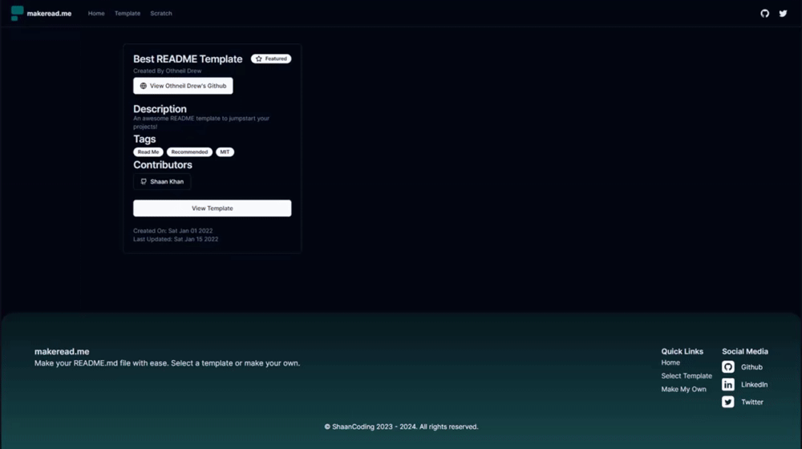

<br/>
<div align="center">
<a href="https://github.com/ShaanCoding/makeread.me">

</a>
<h3 align="center">makeread.me</h3>
<p align="center">
An awesome ReadMe Generator to Jumpstart your Projects!
<br/>
<br/>
<a href="https://github.com/ShaanCoding/makeread.me/wiki"><strong>Explore the docs »</strong></a>
<br/>
<br/>
<a href="https://www.makeread.me/">View Demo .</a>  
<a href="https://github.com/ShaanCoding/makeread.me/issues/new?labels=bug&amp;template=bug_report.md">Report Bug .</a>
<a href="https://github.com/ShaanCoding/makeread.me/issues/new?labels=enhancement&amp;&template=feature_request.md">Request Feature</a>
</p>
</div>

  

## Table of Contents

- [Table of Contents](#table-of-contents)
- [About The Project](#about-the-project)
  - [Built With](#built-with)
- [Getting Started](#getting-started)
  - [Prerequisites](#prerequisites)
  - [Installation](#installation)
- [Roadmap](#roadmap)
- [Contributing](#contributing)
- [License](#license)
- [Contact](#contact)
- [Acknowledgments](#acknowledgments)
- [Notice](#notice)

## About The Project



One of the challenges with building and contributing to open source software is that while many projects have amazing functionalities, they often miss out on reaching a wider audience due to lack of clear and user-friendly installation instructions. In addition, lack of efficient showcase of their use cases also contribute to the lower reach of these projects.

While there are ReadME templates that can help address this, the process of manually filling out these templates can be time-consuming and tedious. That&#39;s where our project makeread.me comes in.

Introducing makeread.me, an automated ReadMe Generator that can revolutionize how you create your project documentation. It is designed to:

- Save your valuable time enhancing your focus on development,
- Automate redundant tasks, and,
- Implement DRY (Don&#39;t Repeat Yourself) principles to your documentation.

It&#39;s free, open-source, and highly customizable. Feel free to modify our templates to fit your needs. If you find that a particular component is missing, you are more than welcome to contribute and expand the project.

We&#39;ve made it easy for you to contribute to the project by using Nunjucks and JSON templates for programmatic mapping. Enjoy the benefits of clear and concise project documentation with makeread.me!

### Built With

This project was built with the following technologies:

- [Next.js](https://nextjs.org/)
- [React](https://react.dev/)
- [Shadcn/ui](https://ui.shadcn.com/)
- [React Hook Form](https://react-hook-form.com/)
- [Typescript](https://www.typescriptlang.org/)
- [Express](https://expressjs.com/)

## Getting Started

This is an example of how you may give instructions on setting up your project locally.
To get a local copy up and running follow these simple example steps.

### Prerequisites

This project requires Yarn to be installed in your system. If you don&#39;t have it installed, you can follow these steps:

- Install Yarn globally using npm (Node Package Manager). Open your terminal and run:

  ```sh
  npm install -g yarn
  ```

  Please ensure that you have Node.js and npm installed before running Yarn.

- Verify that Yarn has been installed on your machine by running the following command in your terminal:

  ```sh
  yarn --version
  ```

  If Yarn has been installed correctly, your terminal should display the version of Yarn installed on your machine.

Now you are ready to use Yarn for managing and versioning your project dependencies!

### Installation

Please follow the following steps for successful installation:

1. **Clone the Repository:** Get started by cloning the repository to your local machine.

   ```
   https://github.com/ShaanCoding/makeread.me
   ```

2. **Install Frontend Packages:** Navigate to the &quot;/frontend&quot; directory and install the required yarn packages by executing the following command in your terminal:

   ```sh
   yarn install
   ```

3. **Install Backend Packages:** Similarly, navigate to the &quot;/backend&quot; directory and install the required yarn packages by executing the following command in your terminal:

   ```sh
   yarn install
   ```

4. **Set Up Environment:**

   - In the &quot;/backend&quot; directory, copy the content of &quot;.env.example&quot; file and create a new file named &quot;.env&quot;. Adjust the environment variables according to your requirements or you can leave them as it is.

   - Navigate to &quot;frontend/api/generated/readMeGenerator.ts&quot; and set the BASE parameter to your backend API route. For instance, if you are running backend on your local server at port 8080, you should set:

     ```javascript
     BASE: "http://localhost:8080/api";
     ```

5. **Run the Backend:** Navigate to &quot;/backend&quot; directory and type the following command in your terminal to run your backend server:

   ```sh
   yarn dev
   ```

6. **Run the Frontend:** Finally, navigate to &quot;/frontend&quot; directory and type the following command in your terminal to run your frontend server:

   ```sh
   yarn dev
   ```

   Now, your application should be successfully up and running!

## Roadmap

The roadmap includes both completed and future goals. Here&#39;s what we have accomplished and looking forward to:

- [x] Add backend swagger generation
- [x] Add backend
- [x] Set up CI/CD on railway
- [x] Allow dynamic input field generation based off a JSON file
  - [x] Textarea
  - [x] Input
  - [ ] Objects
  - [x] Array
- [x] Allow users to set the order of components or delete them
- [x] Allow templating via Nunjucks
- [x] Add Plausible Analytics
- [x] Add old readme generator template
- [ ] Add more templates
- [ ] Move rendering logic to the backend with debounce
- [ ] Replace useEffect with react query
- [ ] Add caching
- [ ] Write up README best practice articles
- [ ] Avoid key collisions when using non-unique-names as Ids in templates

We continue our commitment to improving and expanding the capabilities of makeread.me to provide an efficient and seamless readme generation experience to our users.

See the [open issues](https://github.com/ShaanCoding/makeread.me/issues) for a full list of proposed features (and known issues).

## Contributing

Contributions are what make the open source community such an amazing place to learn, inspire, and create. Any contributions you make are **greatly appreciated**.

If you have a suggestion that would make this better, please fork the repo and create a pull request. You can also simply open an issue with the tag &quot;enhancement&quot;.
Don&#39;t forget to give the project a star! Thanks again!

1. Fork the Project
2. Create your Feature Branch (`git checkout -b feature/AmazingFeature`)
3. Commit your Changes (`git commit -m &#39;Add some AmazingFeature&#39;`)
4. Push to the Branch (`git push origin feature/AmazingFeature`)
5. Open a Pull Request

## License

Distributed under the Mozilla Public License 2.0 License. See [Mozilla Public License 2.0 License](https://github.com/ShaanCoding/makeread.me/blob/main/LICENSE.md) for more information.

## Contact

If you have any questions or suggestions, feel free to reach out to us:

- Raise an issue on the repository: [GitHub Repository](https://github.com/ShaanCoding/makeread.me)
- Connect with us on Twitter: [@ShaanCoding](https://twitter.com/ShaanCoding)

## Acknowledgments

A special thanks to the following for their contributions, support and inspiration:

- [makeread.me](https://github.com/ShaanCoding/makeread.me)
- [Othneil Drew](https://github.com/othneildrew/Best-README-Template)

## Notice

This ReadMe was generated using [makeread.me](https://www.makeread.me/) 🚀
